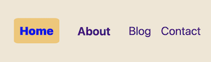

# Coder Academy Full Stack Web Development Diploma 
## HernanVelasquez_T1A2

#### Website: [HernanVelasquez](https://hernanvelasquez-t1a2.netlify.app/)
#### Repository: [Github repo](https://github.com/hernan-vela/HernanVelasquez_T1A2)

## Purpose
With this project is pretended to build up skills on constructing websites by using HTML and CSS as primary framework, and also as an online portfolio for future employers that might be interested on looking at products of my own manufacture. The minimalist design pretends to show my abilities to understand, create, and modify features in a website using HTML and CSS primarly, but this initial version of this portfolio does not intend to highlight my graphical design abilities.

This also will be considered as an assignment to gain a qualification in the future, as a full stack web developer.

## Functionality and Features
This portfolio shows a Home page housing four main different pages with images, text, links, animated links, buttons and a form for user input. The website is intended to be easily browsed, with few information, simple buttons, and a simple design.

### Bespoken HTML and CSS files
The raw files to create the website were coded from scratch using VSCode, and all the resources, files, and relevant information reside in an online repository in Github (see link at the top).

### Website Layout
The site is comprised by a Home page with a profile picture of myself and a brief description of interests and personality, an About page with my education highlights and professional experience and a button link to a mock up resume; a Blog page that shows five made-up publications, each one with image, heading and date of post, which are linked to a generic post. It is also included a Contact page where an user can type information an submit it through a button at the bottom of the form.

.png)
Screenshot of sitemap

### Logo and Navigation Bar (navbar)
Along the different pages of the whole website the header remains the same with the logo on the top left and a navbar on the top right. The logo shows my name (brand) and is when clicked it takes the user the Home page.

Screenshot of Header

The navbar has a simple animation: it shows the page where user currently is highlighted in a different color, and when a the user hovers with the pointer, text is enlarged with a slight change on font weight.

User inside Home page

User inside About page

 
About highligthed when hovered

(List of details that need to be included in this
Readme file: Description of website including purpose,
functionality / features, screenshots, sitemap, target,
audience, tech stack)

## Portfolio Website

![texto alternativo]