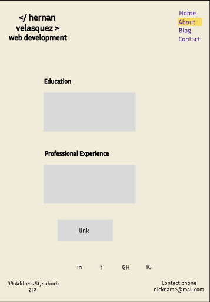

# Coder Academy Full Stack Web Development Diploma 
## HernanVelasquez_T1A2

#### Website: [HernanVelasquez](https://hernanvelasquez-t1a2.netlify.app/)
#### Repository: [Github repo](https://github.com/hernan-vela/HernanVelasquez_T1A2)

## Purpose
With this project is pretended to build up skills on constructing websites by using HTML and CSS as primary framework, and also as an online portfolio for future employers that might be interested on looking at products of my own manufacture. The minimalist design pretends to show my abilities to understand, create, and modify features in a website using HTML and CSS primarly, but this initial version of this portfolio does not intend to highlight my graphical design abilities.

This also will be considered as an assignment to gain a qualification in the future, as a full stack web developer.

### Target audience
My portfolio will be aim to show potential employers, future colaborators, and in general people interested on designing websites, the knowledge that I have acquired until this point in regards to creation of online content.

## Tech Stack
This website has been built until this point, using entirely HTML and CSS. The CSS web layout commonly known as Flexbox has been extensively used across the site to facilitate responsiveness.

## Functionality and Features
This portfolio shows a Home page housing four main different pages with images, text, links, animated links, buttons and a form for user input. The website is intended to be easily browsed, with few information, simple buttons, and a simple design.

### Bespoken HTML and CSS files
The raw files to create the website were coded from scratch using VSCode, and all the resources, files, and relevant information reside in an online repository in Github (see link at the top).

### Website Layout
The site is comprised by a Home page with a profile picture of myself and a brief description of interests and personality, an About page with my education highlights and professional experience and a button link to a mock up resume; a Blog page that shows five made-up publications, each one with image, heading and date of post, which are linked to a generic post. It is also included a Contact page where an user can type information an submit it through a button at the bottom of the form.

.png)
Screenshot of sitemap

### Logo and Navigation Bar (navbar)
Along the different pages of the whole website the header remains the same with the logo on the top left and a navbar on the top right. The logo shows my name (brand) and is when clicked it takes the user the Home page.

Screenshot of Header

The navbar has a simple animation: it shows the page, where the user currently is highlighted in a different color, and when the user hovers with the pointer, the text is enlarged with a slight change on font weight.

User inside Home page

User inside About page

 
About highligthed when hovered

### Footer and social media icons
Similar to the header, the footer remains the same in all the pages of the site, with the contact information on the right bottom and icons linked to social media sites. These icons are clean, and they will take the user to its respective website if clicked.

Screenshot of footer

     
Screenshot of social media icons

### Link to professional profile
Inside the About page an image of a folder is showed, with the text "see more" next to it. This is a link that will take the user to a PDF of my resume (mock up profile)

Screenshot of icon linked to CV

### Responsiveness
The website is build with responsiveness in mind, feature that allows adaptation to different screen sizes as laptop, tablet and mobile devices. This quality changes the size of images, text and organisation of features to better reading and interaction.

## Wireframes
Below it is showed screenshots of the raw design of each page of the website. Each page has three versions of wireframes: laptop, tablet and mobile size.

### Home Page 

Screenshot of Home laptop design

       
Screenshot of Home tablet design

     
Screenshot of Home mobile design

### About Page

Screenshot of About laptop design

   
Screenshot of About tablet design

  
Screenshot of About mobile design

### Blog Page

### Contact Page
